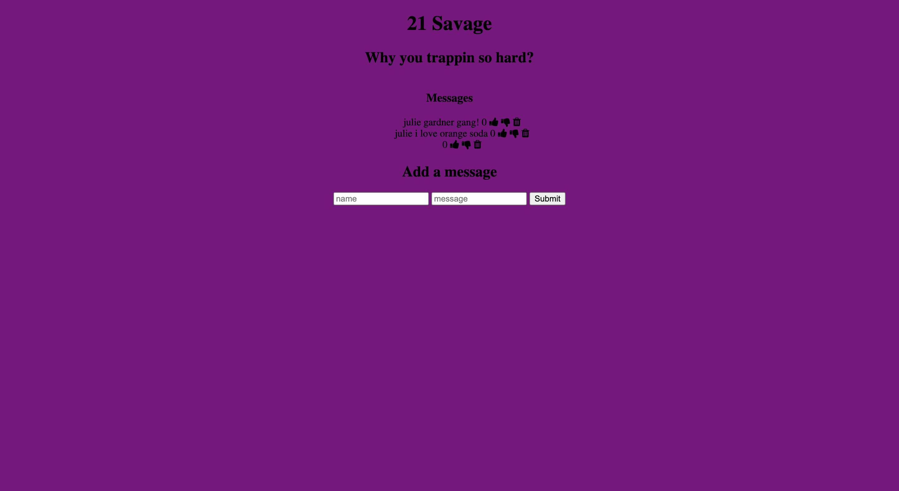

This is an app where users can write messages to a message board and other users can dislike messages by giving a thumbs down.

Link to Project: [https://savagedemo-savageauth.netlify.app/]

How It's Made:

Tech Used: EJS, CSS, JavaScript, Node.js, Express.js and MongoDB.

Optimizations: 

Lesson Learned: I learned how to use CRUD functions and stored data in MongoDB. 

